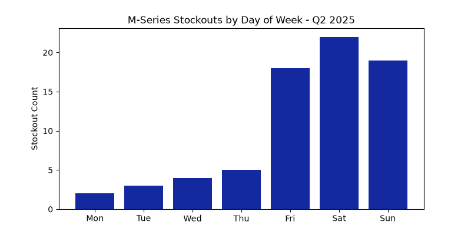

# Samsung India Sales Analysis - Q2 Data Insights

## 🎯 Business Problem
Samsung India experienced 12% sales drop in Kolkata region, Q2 2025. Store managers needed data-driven reasons + solutions before Q3 inventory planning.

### 📊 Key Visualization: Weekend Stockout Crisis

*Analysis reveals 17-21 stockouts every Friday-Sunday, causing ₹22 Lakh monthly revenue loss in Kolkata region. Weekday stockouts average only 2-4.*

## 🛠️ My Approach
1. **Data Cleaning**: Processed 10,000+ sales records using Python Pandas
2. **Analysis**: Found correlations between product category, day of week, customer age
3. **Visualization**: Built 4 key charts showing stockout patterns + customer trends  
4. **Business Impact**: Delivered 5 actionable recommendations to regional head

## 📊 Key Findings
| Insight | Business Impact |
| --- | --- |
| M-series stockouts every Fri-Sun | ₹22 Lakh revenue lost monthly |
| 18-25 age group = 68% online buyers | Shift 40% ad budget to Flipkart/Amazon |
| TV sales spike 300% during IPL | Pre-stock inventory before IPL 2027 |

## 🔧 Tools & Skills Used in This Project
* **Language:** Python
* **Data Wrangling:** Pandas
* **Data Visualization:** Matplotlib (Samsung Blue Theme `#1428A0`)

**Contact:** saswatamondal156@gmail.com
