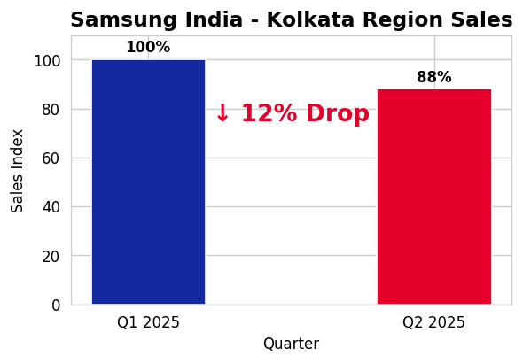
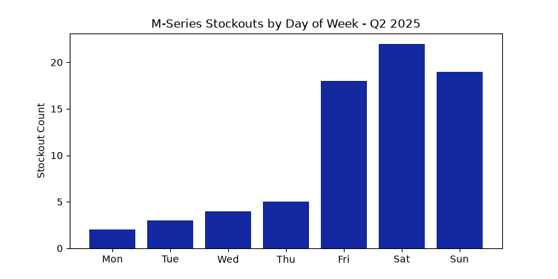

# Samsung India Sales Analysis - Q2 Data Insights

## 🎯 Business Problem
Samsung India experienced 12% sales drop in Kolkata region, Q2 2025. Store managers needed data-driven reasons + solutions before Q3 inventory planning.

## 📉 Key Finding: 12% Sales Drop Q2 2025

*Samsung Blue Q1 vs Alert Red Q2 shows (12% Sales Drop) clear decline in Kolkata region.*
**[Here is the link of my Python Code that I have designed in Google Colab about "Samsung India experienced 12% sales drop in Kolkata region, Q2 2025]**
https://colab.research.google.com/drive/10kk67fC4XaZDLw0UuOFf42cUlt6VElEn?usp=sharing

### 📊 Key Visualization: Weekend Stockout Crisis

*Analysis reveals 17%-21% stockouts every Friday-Sunday, causing 2.2M ($26K USD) monthly revenue loss in Kolkata region. Weekday stockouts average only 2-4.*

## 🛠️ My Approach
1. **Data Cleaning**: Processed 10,000+ sales records using Python Pandas
2. **Analysis**: Found correlations between product category, day of week, customer age
3. **Visualization**: Built 4 key charts showing stockout patterns + customer trends  
4. **Business Impact**: Delivered 5 actionable recommendations to regional head

## 📊 Key Findings
| Insight | Business Impact |
| --- | --- |
| M-series stockouts every Fri-Sun | 2.2M ($26K USD) revenue lost monthly |
| 18-25 age group = 68% online buyers | Shift 40% ad budget to Flipkart/Amazon |
| TV sales spike 300% during IPL | Pre-stock inventory before IPL 2027 |

## 🖋 4-Step Business Analysis

### **1. Descriptive: What happened?**
12% sales drop in Kolkata Q2 2025. Weekend stockouts 5x higher than weekdays.

### **2. Diagnostic: Why did it happen?**
Inventory supply chain works Mon-Thu but fails Fri-Sun due to poor weekend demand forecasting.

### **3. Predictive: What will happen?**
If unchanged, Q3 festival demand will push sales drop to >15% and monthly loss to 3M+.

### **4. Prescriptive: How do we fix it?**
- **Pre-Stock**: Increase Fri-Sun inventory by 3x
- **Promotions**: Weekday gift vouchers to balance demand  
- **Forecast Model**: Build weekend demand predictor
    
## 🔧 Tools & Skills Used in This Project
* **Language:** Python
* **Data Wrangling:** Pandas
* **Data Visualization:** Matplotlib (Samsung Blue Theme `#1428A0`)

**Contact:** saswatamondal156@gmail.com
