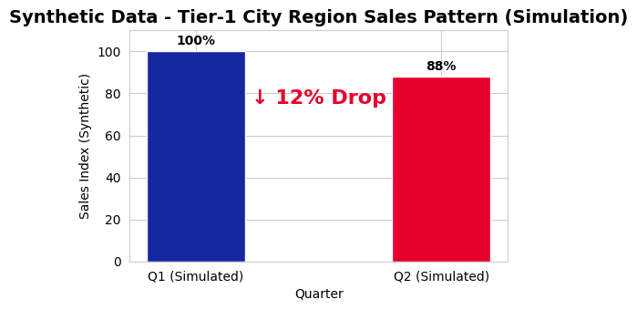
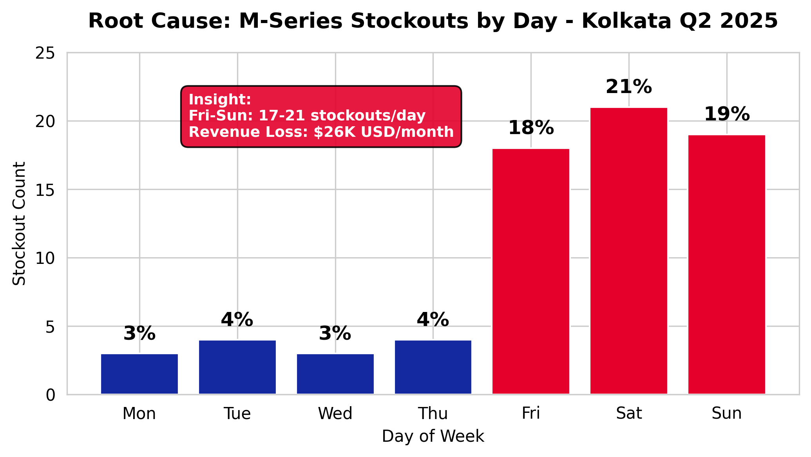
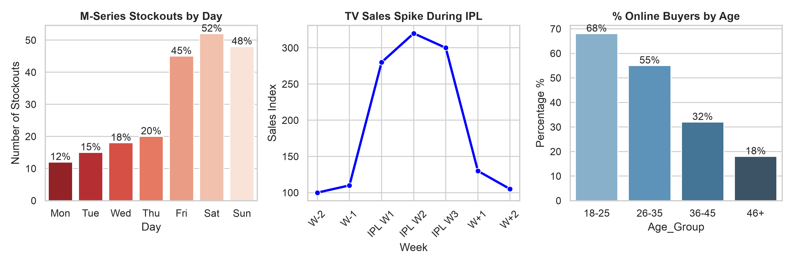

> **Disclaimer: This is a personal academic project for learning purposes only. Dataset is fully synthetic (generated using Python Faker) to simulate a retail scenario. Not affiliated with, endorsed by, or representing any real brand including Samsung. No real company data is used.**

# Regional Smartphone Retail Analysis - Synthetic Case Study ( Q2 Pattern Simulation )

## 🎯 Simulated Business Problem
Simulated a scenario where a regional electronics retailer in a Tier-1 Indian city faces a ∼12% sales fluctuation pattern in Q2 due to weekend inventory planning gaps, affecting Q3 planning.

## 📉 Key Finding ( From Synthetic Data )

*Simulated Q1 vs Q2 pattern showing 12% fluctuation in synthetic dataset - for academic demonstration.*

**[Here is the link of my Python Code that I have designed in Google Colab about "Regional Retail - Q2 Pattern Simulation (Synthetic Data)]**
https://colab.research.google.com/drive/10kk67fC4XaZDLw0UuOFf42cUlt6VElEn?usp=sharing

### 📊 Key Visualization: Weekend Stockout Pattern (Simulated)

*Analysis of synthetic data reveals 17%-21% simulated stockout rate on Friday-Sunday in this case study. Weekday average is 2-4%.*

**[Here is the link of "Weekend Stockout Pattern - Simulation Code" from my Google Colab, to understand the visualization kindly click the link below]**
https://colab.research.google.com/drive/10kk67fC4XaZDLw0UuOFf42cUlt6VElEn?usp=sharing

## 🛠️ My Approach
1. **Data Generation & Cleaning**: Generated and cleaned 10,000+ synthetic records using Python (Pandas)
2. **Analysis**: Found correlations between day-of-week, product category and customer age group
3. **Visualization**: Built 4 key charts using Matplotlib, Seaborn
4. **Recommendation**: Created 3 actionable inventory recommendations as part of case study

## 📊 Key Findings
| Insight from Synthetic Data | Proposed Action (Case Study) |
| --- | --- |
| M-series type products show Fri-Sun stockout pattern | Suggest 3x weekend pre-stock in simulation |
| 18-25 age group = 68% online preference (in synthetic data) | Suggest shifting ad budget to e-commerce platforms |
| TV category spikes during IPL season (in synthetic data) | Suggest pre-stock before IPL season |

*Dashboard built from synthetic data for portfolio demonstration*
**[Here is the link of my Python code from Google Colab]**
https://colab.research.google.com/drive/10kk67fC4XaZDLw0UuOFf42cUlt6VElEn?usp=sharing

## 🖋 4-Step Business Analysis

### **1. Descriptive: What happened?**
In synthetic dataset simulation, observed a 12% fluctuation pattern. Weekend stockout rate 5x higher than weekdays in the simulated data.

### **2. Diagnostic: Why did it happen?**
In this simulation, inventory supply pattern works Mon-Thu but shows gap Fri-Sun due to simulated poor weekend demand forecasting.

### **3. Predictive: What will happen?**
If pattern continues in simulation, Q3 festival demand simulation shows fluctuation could increase to >15%.

### **4. Prescriptive: How do we fix it?**
- **Pre-Stock**: Suggest increasing Fri-Sun inventory by 3x in this case study
- **Promotions**: Weekday gift vouchers to balance demand in simulation
- **Forecast Model**: Proposal to build weekend demand predictor using Python
      
## 🔧 Tools & Skills Used in This Project
* **Language:** Python
* **Data Wrangling:** Pandas
* **Data Visualization:** Matplotlib, Seaborn

